# Modelo de dominio y datos

## 1. Principios

1. Separar el inventario actual de su historial comercial.
2. Separar producto de inventario y modalidad comercial: Netflix compra/gestiona una cuenta estándar o un perfil extra, y luego vende cada producto mediante las modalidades permitidas.
3. Separar la capacidad física de la modalidad comercial: una venta puede ocupar una unidad interna o la cuenta completa.
4. Configurar capacidad y periodicidad; no fijar `5` ni una cantidad de días constante como regla universal.
5. Separar secretos, datos operativos y finanzas para aplicar mínimo privilegio.
6. Calcular alertas y totales desde datos fuente; no guardar celdas derivadas del Excel como verdad.
7. Conservar cada venta, renovación, pago, costo y tasa aplicada para que el balance acumulado sea reproducible.
8. Usar USD como precio comercial manual, Bs (`VES`) como cobro real y USDT como fuente para proveedores/gastos operativos; cada venta/renovación congela BCV, paralela, Bs esperados y Bs cobrados, y cada egreso conserva su valorización histórica a paralela.
9. Separar en Spotify la identidad que conserva login/biblioteca de la cobertura que aporta Premium; un cambio técnico no reescribe la relación comercial.

## 2. Relación propuesta

```mermaid
erDiagram
    AUTH_USERS ||--|| USUARIOS : "identidad"
    USUARIOS ||--o| VENDEDORES : "opera como"
    PLATAFORMAS ||--o{ PRODUCTOS_PLATAFORMA : define
    PLATAFORMAS ||--o{ MODALIDADES : ofrece
    MECANISMOS_ENTREGA ||--o{ PRODUCTO_MODALIDADES : configura
    PRODUCTOS_PLATAFORMA ||--o{ PRODUCTO_MODALIDADES : permite
    MODALIDADES ||--o{ PRODUCTO_MODALIDADES : aplica
    PRODUCTOS_PLATAFORMA ||--o{ CUENTAS : instancia
    CLIENTES ||--o{ CUENTAS : "puede ser titular"
    PROVEEDORES ||--o{ CUENTAS : "gestiona opcionalmente"
    MODALIDADES ||--o{ CUENTA_MODALIDADES : habilita
    CUENTAS ||--o{ CUENTA_MODALIDADES : admite
    CUENTAS ||--o| CREDENCIALES_CUENTA : protege
    CUENTAS ||--o{ UNIDADES_INVENTARIO : divide
    UNIDADES_INVENTARIO ||--o| SECRETOS_UNIDAD : protege
    CUENTAS ||--o{ RESERVAS_INVENTARIO : "reserva completa"
    UNIDADES_INVENTARIO ||--o{ RESERVAS_INVENTARIO : "reserva unidad"
    CLIENTES ||--o{ SUSCRIPCIONES : contrata
    CONTACTOS_COMERCIALES ||--o{ SUSCRIPCION_CONTACTOS : participa
    SUSCRIPCIONES ||--o{ SUSCRIPCION_CONTACTOS : coordina
    VENDEDORES ||--o{ SUSCRIPCIONES : vende
    PRODUCTOS_PLATAFORMA ||--o{ SUSCRIPCIONES : comercializa
    MODALIDADES ||--o{ SUSCRIPCIONES : define
    SUSCRIPCIONES ||--o{ HISTORIAL_ESTADO_SUSCRIPCION : cambia
    SUSCRIPCIONES ||--o{ ASIGNACIONES_INVENTARIO : recibe
    CUENTAS ||--o{ ASIGNACIONES_INVENTARIO : "presta completa"
    UNIDADES_INVENTARIO ||--o{ ASIGNACIONES_INVENTARIO : "presta unidad"
    ASIGNACIONES_INVENTARIO ||--o{ ENTREGAS_ACCESO : habilita
    USUARIOS ||--o{ ENTREGAS_ACCESO : realiza
    UNIDADES_INVENTARIO ||--o{ OPERACIONES_REMOTAS : sanea
    ASIGNACIONES_INVENTARIO ||--o{ OPERACIONES_REMOTAS : origina
    USUARIOS ||--o{ SESIONES_CARGA_INICIAL : controla
    SESIONES_CARGA_INICIAL ||--o{ PERIODOS_SERVICIO : autoriza
    SUSCRIPCIONES ||--o{ PERIODOS_SERVICIO : renueva
    PERIODOS_SERVICIO ||--o{ PAGOS_CLIENTE : cobra
    TASAS_CAMBIO ||--o{ PERIODOS_SERVICIO : referencia
    TASAS_CAMBIO ||--o{ PAGOS_CLIENTE : convierte
    CLIENTES ||--o{ IDENTIDADES_SPOTIFY : "puede ser titular"
    SUSCRIPCIONES ||--o{ VINCULOS_IDENTIDAD_SPOTIFY : usa
    IDENTIDADES_SPOTIFY ||--o{ VINCULOS_IDENTIDAD_SPOTIFY : identifica
    CUENTAS ||--o| COBERTURAS_SPOTIFY : especializa
    IDENTIDADES_SPOTIFY o|--o{ COBERTURAS_SPOTIFY : "es madre opcional"
    COBERTURAS_SPOTIFY ||--o| CONTROLES_PAGO_SPOTIFY : controla
    COBERTURAS_SPOTIFY ||--o{ INCIDENCIAS_SPOTIFY : agrupa
    INCIDENCIAS_SPOTIFY ||--o{ CASOS_INCIDENCIA_SPOTIFY : afecta
    SUSCRIPCIONES ||--o{ CASOS_INCIDENCIA_SPOTIFY : conserva
    CASOS_INCIDENCIA_SPOTIFY ||--o{ OPERACIONES_REMOTAS : ejecuta
    CUENTAS ||--o{ CICLOS_PROVEEDOR : renueva
    PROVEEDORES ||--o{ CICLOS_PROVEEDOR : cobra
    CICLOS_PROVEEDOR ||--o{ PAGOS_PROVEEDOR : paga
    TASAS_CAMBIO ||--o{ CICLOS_PROVEEDOR : referencia
    TASAS_CAMBIO ||--o{ PAGOS_PROVEEDOR : convierte
    CATEGORIAS_GASTO ||--o{ GASTOS_OPERATIVOS : clasifica
    TASAS_CAMBIO ||--o{ GASTOS_OPERATIVOS : valoriza
    USUARIOS ||--o{ GASTOS_OPERATIVOS : registra
    TASAS_CAMBIO ||--o{ CIERRES_MENSUALES : valoriza
    CIERRES_MENSUALES ||--o{ DETALLES_CIERRE_MENSUAL : contiene
    UNIDADES_INVENTARIO ||--o{ HISTORIAL_ESTADO_UNIDAD : audita
    USUARIOS ||--o{ SOLICITUDES_STOCK : solicita
    PRODUCTOS_PLATAFORMA ||--o{ SOLICITUDES_STOCK : requiere
    SOLICITUDES_STOCK ||--o| RESERVAS_INVENTARIO : genera
```

## 3. Diccionario de entidades

### Identidad y catálogo

#### `usuarios`

Perfil interno vinculado uno a uno con `auth.users`.

Campos esenciales: `id`, `nombre`, `rol`, `activo`, `created_at`, `updated_at`.

Reglas:

- `rol` inicial: `admin | revendedor`.
- El usuario no puede cambiar su propio rol.
- Un registro de `vendedores` puede existir sin login hasta ser vinculado a un usuario.

#### `vendedores`

Identidad comercial usada por ventas históricas y reportes.

Campos esenciales: `id`, `usuario_id` opcional y único, `nombre`, `alias`, `activo`.

Permite registrar manualmente un nombre histórico de `Vendió` **solo después de clasificarlo como vendedor real**, aunque esa persona aún no tenga acceso. Si la celda representaba a un comprador/intermediario se usa `contactos_comerciales`, no esta entidad. Cuando existe login, RLS relaciona la venta con `usuario_id = auth.uid()`; un usuario no puede escoger arbitrariamente el vendedor de otra persona.

#### `plataformas`

Catálogo de Netflix, HBO, Disney+, Prime Video, Crunchyroll, Paramount+, Universal+, VIX, FlujoTV, Telelatino, CapCut, Gemini/Google Cloud, Canva, YouTube, Spotify y las demás plataformas que el usuario confirme.

Campos: `id`, `nombre`, `slug`, `icono_url`, `activa`.

`slug` es único y sirve para URL; los filtros internos usan el UUID real.

#### `modalidades`

Describe cómo se comercializa un inventario o servicio dentro de una plataforma.

Campos: `id`, `plataforma_id`, `nombre`, `tipo_modalidad`, `alcance_asignacion`, `periodicidad_predeterminada`, `activa`.

Valores iniciales de `tipo_modalidad`: `perfil`, `cuenta_completa`, `extra`, `servicio_individual`, `dispositivo`, `miembro_familiar`, `uso_principal` y `asiento`. `alcance_asignacion` comienza con `unidad | cuenta | principal`. `perfil`, `extra`, `dispositivo`, `miembro_familiar` y `asiento` usan alcance `unidad`; `cuenta_completa` y el servicio individual sobre un recurso indivisible usan alcance `cuenta`; `uso_principal` representa el uso no administrativo de una identidad madre y usa alcance `principal`. Que Netflix extra se asigne como una unidad única no presupone aún si su activación técnica será por credencial, invitación u otro mecanismo. La periodicidad inicial será `mes_calendario`.

Una modalidad de perfil ocupa una unidad interna. Una modalidad de cuenta completa ocupa la cuenta y toda su capacidad física, pero continúa siendo una sola suscripción, un período y un ingreso. El alcance `principal` no equivale a cuenta completa: puede coexistir con las unidades hijas, no consume una de ellas y solo se usa cuando la ficha —inicialmente Spotify— separa explícitamente el uso de la madre de su administración.

#### `productos_plataforma`

Describe qué clase de inventario se compra o administra dentro de una plataforma, independientemente de cómo se venda.

Campos: `id`, `plataforma_id`, `nombre`, `codigo`, `tipo_inventario`, `tipo_unidad_fisica` opcional, `regla_capacidad`, `capacidad_fija` opcional, `capacidad_min` opcional, `capacidad_max` opcional, `capacidad_vendible_predeterminada` opcional, `titularidad_predeterminada` opcional, `reutilizable_predeterminado`, `estado_comercial`, `permite_renovaciones`, `descripcion_operativa`, `activo`.

`tipo_inventario` comienza con `cuenta_con_unidades | recurso_indivisible`; describe la forma física administrada, no cómo se entrega ni vende. `cuenta_con_unidades` crea slots hijos; `recurso_indivisible` usa el registro padre, exige capacidad uno y no crea una unidad artificial. Los tipos iniciales de `tipo_unidad_fisica` son `perfil | extra | dispositivo | miembro_familiar | asiento` y solo aplican cuando existen unidades hijas. Ambos catálogos podrán ampliarse cuando otra ficha demuestre una estructura distinta.

`titularidad_predeterminada`: `negocio | cliente | proveedor`, cuando la ficha la confirme. `estado_comercial`: `abierto | solo_cartera | cerrado`; es independiente de `activo`, porque un producto puede conservar cartera e historia sin aceptar clientes nuevos. `permite_renovaciones` controla por separado las operaciones sobre cartera. YouTube inicia en `solo_cartera`; si sus tres servicios continúan renovándose se resolverá en `YT-07` antes de implementar.

`regla_capacidad`: `fija | rango | variable`. La cuenta creada debe satisfacerla. Se aplican estos checks:

- `fija`: `capacidad_fija > 0` y mínimo/máximo nulos;
- `rango`: mínimo y máximo positivos, `min <= max` y capacidad fija nula;
- `variable`: capacidad fija nula; los límites pueden ser nulos, pero si existen son positivos y coherentes.
- `recurso_indivisible`: exige regla fija, capacidad uno y `tipo_unidad_fisica IS NULL`.

`capacidad_vendible_predeterminada` define cuántas unidades físicas participan en stock, ocupación comercial y distribución analítica del costo cuando no todas se venden. Si es nula, se asume igual a la capacidad física. Debe ser positiva y no puede superar la capacidad física efectiva. CapCut usa tres físicos y dos vendibles (único caso confirmado de capacidad física ≠ vendible).

`(plataforma_id, codigo)` es único. Una configuración ya usada por cuentas o historia no cambia de significado ni reduce capacidad retroactivamente: se archiva y se crea una nueva versión/producto cuando cambie la regla. `cuentas.capacidad` conserva el valor efectivo de cada recurso.

Ejemplos confirmados:

| Plataforma | Producto | Estructura | Capacidad | Modalidades permitidas | Estado comercial |
|---|---|---|---:|---|---|
| Netflix | Cuenta estándar | Cuenta con unidades | 5 | `perfil`, `cuenta_completa` | Abierto |
| Netflix | Perfil extra | Una unidad | 1 | `extra` | Abierto |
| HBO | Cuenta estándar | Cuenta con unidades | 5 | `perfil`, `cuenta_completa` | Abierto |
| Disney+ | Cuenta estándar | Cuenta con unidades | 7 | `perfil`, `cuenta_completa` | Abierto |
| Prime Video | Cuenta estándar | Cuenta con unidades | 7 | `perfil`, `cuenta_completa` | Abierto |
| Crunchyroll | Cuenta estándar | Cuenta con unidades | 5 | `perfil`, `cuenta_completa` | Abierto |
| Paramount+ | Cuenta estándar | Cuenta con unidades | 6 | `perfil`, `cuenta_completa` | Abierto |
| Universal+ | Cuenta estándar | Cuenta con unidades | 5 | `perfil`, `cuenta_completa` | Abierto |
| VIX | Cuenta estándar | Cuenta con unidades | 5 | `perfil`, `cuenta_completa` | Abierto |
| FlujoTV | Cuenta por dispositivos | Cuenta con unidades | 3 | `dispositivo`, `cuenta_completa` | Abierto |
| Telelatino | Cuenta por dispositivos | Cuenta con unidades | 3 | `cuenta_completa`; `dispositivo` pendiente | Abierto |
| CapCut | Cuenta por dispositivos | Cuenta con unidades | 3 físicos / 2 vendibles | `dispositivo`, `cuenta_completa` pendiente de detalle | Abierto |
| Gemini / Google Cloud | Grupo familiar | Cuenta con unidades | 5 | `miembro_familiar` | Abierto |
| Canva | Panel educativo | Cuenta con unidades | Variable por confirmar | `asiento` | Abierto |
| YouTube | Servicio en Gmail del cliente | Provisional: recurso cliente; inventario proveedor por confirmar | 1 servicio visible; capacidad proveedor pendiente | Provisional: `servicio_individual` | Solo cartera |
| Spotify | Premium individual | Recurso indivisible + identidad separada | 1 | `servicio_individual` con origen propio GPay o proveedor | Abierto |
| Spotify | Familia Premium | Cuenta con unidades + identidad madre separada | 5 miembros; principal concurrente no consume slot | `miembro_familiar`, `uso_principal` | Abierto |

En YouTube están confirmados el Gmail/contraseña del cliente, las tres filas actuales y la ausencia de ventas nuevas. La clasificación `recurso_indivisible` de capacidad comercial uno es el modelo de trabajo para la prestación visible; `YT-06` debe confirmar si debajo consume un cupo reutilizable de un plan compartido. Si existe, se añadirá esa capa de inventario proveedor y no se confundirá con el Gmail no reutilizable.

El producto individual de Spotify separa su identidad de un recurso de cobertura `1/1`; el origen de activación distingue si GL Streaming controla la suscripción mediante GPay o si un proveedor activa/reactiva la misma identidad, sin convertir esa procedencia en otro producto comercial. La familia tiene cinco slots físicos/vendibles de `miembro_familiar`. Su identidad madre no es un sexto slot ni una venta completa: `uso_principal` puede coexistir con las cinco asignaciones de miembro y su desocupación no participa en capacidad ociosa.

“Más costoso” o “más estable” no determina el producto mediante inferencias. Netflix extra se identifica por `producto_plataforma_id`; el precio real vive en el período y cualquier observación de estabilidad es descriptiva.

#### `producto_modalidades`

Relación de modalidades permitidas por cada producto.

Campos: `producto_plataforma_id`, `modalidad_id`, `mecanismo_entrega_id` opcional durante documentación, `activa`, `created_at`, `archived_at`.

La pareja es única y producto/modalidad pertenecen a la misma plataforma. Una cuenta nunca puede habilitar una modalidad ausente de esta relación. Antes de activar la combinación para vender, debe tener un mecanismo de entrega confirmado en su ficha.

#### `mecanismos_entrega`

Catálogo de cómo se habilita el acceso al cliente, separado del producto y de la modalidad comercial.

Campos conceptuales: `id`, `codigo`, `nombre`, `tipo`, `descripcion`, `activo`.

Tipos candidatos: `credenciales_cuenta`, `credenciales_y_unidad`, `credenciales_cliente`, `identidad_y_cobertura`, `invitacion`, `asiento`, `dispositivo`, `grupo_familiar`, `panel_educativo`, `otro`. No se habilita un tipo para una plataforma por semejanza: cada ficha confirma los datos, secretos, aceptación y estados requeridos. En una cuenta compartida también debe configurarse `politica_revocacion_acceso`: cierre de sesiones/dispositivos por perfil/cupo como regla normal, o rotación de credenciales cuando la plataforma no permita cierre selectivo. En grupos o paneles por invitación, la revocación es sacar el correo del cliente del grupo/panel. Sin esa política no se confirma una liberación. `credenciales_cliente` identifica que el titular del acceso es el cliente, como en YouTube; no cambia las restricciones de cifrado y auditoría. `identidad_y_cobertura` exige dos historiales vigentes coordinados y se usa en Spotify. `NET-05` mantiene inactiva la modalidad extra hasta elegir su mecanismo exacto.

#### `proveedores`

Entidad configurable que identifica quién suministra o gestiona un servicio. Puede ser el propio negocio o un tercero y no implica por sí sola que exista un pago.

Campos: `id`, `tipo`, `nombre_o_alias` opcional, `telefono_original` opcional, `telefono_normalizado` opcional, `notas`, `activo`.

`tipo`: `propio | tercero`. Debe existir al menos `nombre_o_alias` o `telefono_original`; ambos teléfonos son texto. Se crea un registro canónico propio, mostrado como `Yo`, que puede ser el valor predeterminado de YouTube. Crear o seleccionar este proveedor operativo no crea un ciclo, costo ni pago.

`proveedores` no guarda el instrumento en claro: solo conserva un alias no
sensible (banco/apodo + últimos cuatro) o un token externo. Cuando el proveedor
es una tarjeta propia importada del Excel, `tarjetas_proveedor_cifradas` guarda
PAN y vencimiento cifrados en la aplicación y enlazados uno a uno al proveedor.
Solo un administrador los revela temporalmente y con auditoría. El código de
seguridad/CVV se descarta antes del cifrado y nunca se persiste.

### Inventario y secretos

#### `cuentas`

Fila padre operativa.

Campos sugeridos: `id`, `producto_plataforma_id`, `alias`, `capacidad`, `capacidad_vendible_habilitada`, `titular_tipo`, `cliente_propietario_id` opcional, `reutilizable`, `proveedor_operativo_id` opcional, `estado`, `created_at`, `archived_at`.

El correo/login y la contraseña no viven aquí. `estado` representa disponibilidad técnica de la cuenta: `activa`, `mantenimiento`, `suspendida`, `archivada`. `proveedor_operativo_id` identifica quién gestiona/suministra el servicio aunque no exista costo; el proveedor financiero permanece en cada ciclo para permitir cambios futuros sin reescribir historia.

La plataforma se obtiene mediante el producto. La cuenta no contiene una única `modalidad_id`: las cuentas híbridas confirman que una misma cuenta puede venderse por perfiles o completa en intervalos distintos. `capacidad` debe satisfacer `productos_plataforma.regla_capacidad`; no basta con que sea mayor que cero. `capacidad_vendible_habilitada` debe ser positiva, no superar `capacidad` y tomar el valor predeterminado del producto salvo excepción auditada. En `cuenta_con_unidades`, al activar el recurso una operación transaccional verifica que existan exactamente sus unidades físicas vigentes y que sus slots cubran `1..capacidad`; un `recurso_indivisible` exige capacidad uno y cero filas hijas. Un alta incompleta nunca aparece como stock. `producto_plataforma_id` queda inmutable al activar el recurso o crear unidades/ciclos/historia; una corrección excepcional requiere una migración auditada y no una edición normal.

`titular_tipo = cliente` exige `cliente_propietario_id`, vuelve el recurso no reutilizable y prohíbe asignarlo a una suscripción de otra persona. Cerrarlo o finalizarlo lo archiva/retira; nunca lo publica como stock. YouTube usa esta regla. Producto, titular, cliente propietario y reutilización quedan inmutables al activar el recurso o crear historia; una corrección excepcional crea un recurso sustituto y enlaza el anterior, sin mutarlo. El proveedor operativo sí puede cambiar mediante una acción auditada y cada período/ciclo conserva su snapshot histórico.

#### `cuenta_modalidades`

Declara qué modalidades comerciales admite una cuenta/recurso concreto.

Campos: `cuenta_id`, `producto_plataforma_id`, `modalidad_id`, `activa`, `created_at`, `archived_at`.

La pareja `(cuenta_id, modalidad_id)` es única. FKs compuestas garantizan que `producto_plataforma_id` sea el producto de la cuenta y que `(producto_plataforma_id, modalidad_id)` exista en `producto_modalidades`. Habilitar dos modalidades no significa que puedan usarse simultáneamente; la compatibilidad temporal se valida al reservar o asignar inventario.

Los productos estándar de Netflix, HBO, Disney+, Prime Video, Crunchyroll, Paramount+, Universal+ y VIX permiten `perfil` y `cuenta_completa`; sus cuentas las habilitan por defecto. FlujoTV permite `dispositivo` y `cuenta_completa`; Telelatino solo tiene confirmada `cuenta_completa` hasta resolver `TEL-01`; CapCut permite `dispositivo` y mantiene pendiente el alcance exacto de `cuenta_completa` en `CAP-01`. Gemini/Google Cloud habilita `miembro_familiar`. Canva habilita `asiento`. Netflix extra permite y habilita únicamente `extra`. Spotify individual habilita `servicio_individual`; la familiar habilita `miembro_familiar` y `uso_principal`, cuya compatibilidad simultánea es intencional. `cuenta_modalidades` puede desactivar una modalidad para un recurso concreto por una restricción operativa explícita y auditada, pero nunca agregar una no permitida por el producto. La capacidad efectiva continúa en `cuentas.capacidad` y se valida contra el producto.

Para conciliar la cartera YouTube, `registrar_servicio_existente` crea explícitamente la combinación provisional `servicio_individual` con alcance `cuenta` solo dentro de la sesión de carga inicial. Esto no habilita ventas nuevas. `YT-01/YT-06` decidirán si esa combinación queda como modalidad definitiva o si requiere además una asignación a inventario proveedor separado.

#### `credenciales_cuenta`

Contenedor restringido y opcional para login y contraseña de streaming.

Campos conceptuales: `cuenta_id`, `tipo_credencial`, `titular_tipo`, `cliente_titular_id` opcional, `login_cifrado` opcional, `login_fingerprint` opcional, `contrasena_cifrada` opcional, `version_clave`, `rotada_at`, `eliminada_at` opcional.

Solo un camino de servidor autorizado puede revelar los valores completos. Cada lectura se audita. No se incluyen en vistas generales ni respuestas de inventario. Una vista administrativa específica puede mostrar únicamente `login_enmascarado`, calculado por el servidor y no reversible. `login_fingerprint` es un HMAC para advertir duplicados sin descifrar ni usar el correo como identificador de cliente. Un recurso entregado mediante invitación u otro mecanismo puede no tener esta fila; la entidad de activación correspondiente se cerrará cuando las fichas definan ese mecanismo, incluido `NET-05`.

En las cuentas compartidas, recibir login/contraseña concede uso, no administración. Solo el administrador puede rotar correo, contraseña, recuperación o datos maestros. El comando de entrega valida una asignación vigente del cliente y devuelve efímeramente el paquete permitido; nunca ofrece una mutación de la cuenta madre al cliente.

El mecanismo YouTube exige Gmail y contraseña cifrados, `titular_tipo = cliente` y el mismo `cliente_titular_id` del recurso. Solo el administrador los revela; eliminar el secreto conserva suscripción, períodos y auditoría. La duración de retención se resolverá en `YT-02/YT-05`.

#### `identidades_spotify`

Representa la cuenta con la que se inicia sesión en Spotify y que conserva la biblioteca del usuario. Es deliberadamente distinta de la cuenta/recurso que aporta Premium.

Campos conceptuales: `id`, `titular_tipo`, `cliente_titular_id` opcional, `tipo_correo`, `login_cifrado`, `login_fingerprint`, `contrasena_cifrada` opcional, `version_clave`, `estado`, `reutilizable`, `sustituye_a_id` opcional, `created_at`, `archived_at`, `secretos_eliminados_at` opcional.

`tipo_correo`: `dominio_gl | gmail_propio | correo_cliente`. `estado`: `activa | saneamiento | sustituida | retirada | archivada`.

Reglas:

- `dominio_gl` y `gmail_propio` pertenecen al negocio; `correo_cliente` exige `titular_tipo = cliente`, `cliente_titular_id` y `reutilizable = false`.
- El correo y la contraseña de Spotify permanecen cifrados y solo se revelan mediante comando auditado. Nunca se guarda la contraseña de Gmail del cliente.
- Una identidad madre de familia siempre pertenece a GL Streaming; ninguna familia usa un correo propiedad del cliente como madre.
- Una identidad GL puede volver a inventario únicamente después de cerrar su vínculo, revocar el acceso anterior y confirmar limpieza de playlists/“Me gusta”. Una identidad cliente nunca se reasigna.
- Al cerrar definitivamente una identidad cliente, se realiza borrado criptográfico de login/contraseña y se conserva solo historia comercial/técnica no sensible. Si regresa, debe facilitar los datos otra vez.
- Una identidad renombrada durante una recuperación se conserva como `sustituida | archivada`; no reaparece como stock por quedar olvidada operativamente.
- La aplicación registra confirmaciones de respaldo/restauración, no el contenido de playlists, “Me gusta” ni códigos efímeros enviados por el cliente.

#### `vinculos_identidad_spotify`

Historial de qué identidad presta la experiencia de usuario a una suscripción Spotify durante cada intervalo, independiente de su asignación de cobertura.

Campos: `id`, `suscripcion_id`, `identidad_spotify_id`, `inicio`, `fin` opcional, `motivo_fin` opcional, `created_by`, `created_at`.

Existe como máximo un vínculo vigente por suscripción y una identidad no sirve a dos suscripciones simultáneas. Un reemplazo por caída familiar cierra el vínculo anterior y abre otro desde el mismo momento operativo; no cambia período, precio, tasas, cobro ni vencimiento. Cambiar solamente de familia puede conservar la identidad y cambiar únicamente `asignaciones_inventario`.

#### `coberturas_spotify`

Extensión uno a uno de `cuentas` que describe cómo el recurso aporta Premium.

Campos conceptuales: `cuenta_id`, `tipo`, `identidad_madre_id` opcional, `estado_admision` opcional, `bloqueada_at` opcional, `motivo_bloqueo` opcional, `ultima_prueba_admision_at` opcional, `desbloqueada_at` opcional, `metodo_control`, `created_at`, `updated_at`.

`tipo`: `individual_gpay_propio | individual_proveedor | familiar`. Para individual, la cuenta genérica es `recurso_indivisible` de capacidad `1/1`, no tiene identidad madre ni estado de admisión. Para familiar, la cuenta es `cuenta_con_unidades`, exige exactamente cinco slots `miembro_familiar`, capacidad física/vendible `5/5` e `identidad_madre_id` propiedad del negocio.

`estado_admision`: `abierta | bloqueada_por_spotify`. Un bloqueo es de toda la familia: mantiene a los miembros ya activos, pero impide reservar, asignar o trasladar cualquier alta nueva hacia sus slots. Los slots vacíos bloqueados no son stock disponible. La fecha de recuperación es desconocida; solo una prueba manual exitosa cambia el estado a `abierta` y deja auditoría.

El uso vendible de `identidad_madre_id` se asigna con alcance `principal`. Puede coexistir con los cinco slots y tiene exclusión únicamente frente a otra reserva/asignación principal. No concede administración, no aumenta `capacidad_vendible_snapshot` y, si está vacío, no genera días de vacancia. Su ingreso se suma cuando se vende, pero el ciclo/costo familiar sigue existiendo una sola vez.

#### `controles_pago_spotify`

Dato operativo crítico que permite controlar una individual propia activada mediante GPay aun si cambian las credenciales Spotify.

Campos conceptuales: `id`, `cobertura_cuenta_id` único, `gmail_cifrado`, `gmail_fingerprint` único global, `origen`, `version_clave`, `created_at`, `archived_at`.

Solo aplica a `individual_gpay_propio`; `origen` comienza con `gpay_nigeria | gpay_usa`. Existe exactamente un Gmail pagador por cobertura y un Gmail no puede controlar otra cobertura individual, ni siquiera después de archivar la anterior, salvo una futura decisión explícita que cambie esta regla. Se cifra, enmascara en listados y audita al revelar. La entidad **no contiene** contraseña, recuperación, segundo factor, PAN ni datos bancarios. Las familiares pagadas por tarjeta/u otro método se controlan mediante su identidad madre y no crean esta fila.

#### `incidencias_spotify`

Agrupa una falla técnica sin convertirla en una operación comercial.

Campos: `id`, `cobertura_origen_cuenta_id`, `tipo`, `estado`, `detectada_at`, `snapshot_afectados_at`, `iniciada_por_id`, `finalizada_at` opcional, `nota_no_sensible` opcional.

Tipos iniciales: `caida_familiar | falla_individual_proveedor | bloqueo_admision`. Estados: `abierta | en_proceso | resuelta | cancelada`. Una caída familiar crea en una sola operación idempotente un caso para **cada** miembro con asignación activa y para el uso principal si está vendido. El conjunto se congela para que ningún afectado desaparezca del procedimiento por cambios posteriores.

#### `casos_incidencia_spotify`

Seguimiento individual dentro de una incidencia por lote.

Campos conceptuales: `id`, `incidencia_id`, `suscripcion_id`, `identidad_origen_id`, `identidad_destino_id` opcional, `asignacion_origen_id`, `asignacion_destino_id` opcional, `tipo_resolucion`, `estado`, `iniciado_at`, `resuelto_at` opcional, `error_no_sensible` opcional.

`tipo_resolucion`: `recrear_identidad | trasladar_cobertura | rescate_individual | reactivar_misma_identidad`. La pareja `(incidencia_id, suscripcion_id)` es única. `recrear_identidad` confirma respaldo, renombrado/archivo de la anterior, creación con el correo habitual, nueva cobertura y restauración; abre nuevos tramos de identidad/asignación en el mismo instante operativo. `rescate_individual` conserva la identidad y sustituye la cobertura para un cliente antiguo. `reactivar_misma_identidad` es la resolución normal de una individual de proveedor.

Ninguna resolución crea `periodos_servicio` ni `pagos_cliente`: beneficiario, contactos, vendedor, precio USD, tasas, Bs esperados/cobrados, inicio y renovación permanecen intactos. Cada paso manual vive en `operaciones_remotas`; los errores/evidencias nunca contienen credenciales, códigos, biblioteca o datos personales innecesarios.

#### `unidades_inventario`

Unidad física mínima dentro de una cuenta, por ejemplo un perfil con PIN.

Campos: `id`, `cuenta_id`, `numero_slot`, `nombre_visible`, `tipo_unidad`, `estado_operativo`, `estado_preparacion`, `created_at`, `archived_at`.

Estados operativos iniciales: `habilitada`, `mantenimiento`, `retirada`. `Disponible`, `reservada` y `asignada` se derivan de asignaciones y reservas vigentes; no se guardan como un texto que pueda quedar desactualizado. Una unidad vigente en mantenimiento o retirada continúa contando para la cardinalidad física, pero no es elegible para reservar o asignar. Una venta completa exige que todas las unidades físicas de la cuenta estén `habilitada`.

`estado_preparacion`: `lista | pendiente_limpieza`. Al iniciar la liberación de un perfil, dispositivo o miembro compartido, la unidad pasa a `pendiente_limpieza` mientras su asignación permanece retenida en `cierre_pendiente`. El administrador elimina/restablece el perfil, cierra la sesión/dispositivo, rota credenciales cuando aplique o saca al correo del grupo familiar según la ficha. La misma transacción local que confirma limpieza y revocación cierra la asignación y devuelve la unidad a `lista`. La fila interna nunca se borra ni pierde su historia. Cada intento/confirmación vive en `operaciones_remotas`, por lo que reutilizar el slot no sobrescribe limpiezas anteriores. Al liberar una venta completa, sus unidades siguen la misma preparación antes de permitir otra modalidad.

Restricciones:

- `unique(cuenta_id, numero_slot)`.
- `numero_slot > 0` y no supera la capacidad de la cuenta.
- `tipo_unidad` coincide con `productos_plataforma.tipo_unidad_fisica` para los productos homogéneos actuales.
- Reservar o asignar exige `estado_preparacion = lista`; una limpieza pendiente bloquea tanto el slot como la venta completa de su cuenta.
- En Spotify familiar, una incorporación o traslado nuevo exige además `coberturas_spotify.estado_admision = abierta`; `bloqueada_por_spotify` no cambia ni expulsa las asignaciones ya vigentes.
- Para `cuenta_con_unidades`, al activar el recurso sus unidades no archivadas cubren exactamente `1..cuentas.capacidad`; la función de alta y una validación diferida impiden publicar cardinalidades incompletas.
- `recurso_indivisible` exige capacidad uno y no crea unidades hijas.
- En una cuenta híbrida se crean sus unidades físicas reales —cinco para Netflix estándar/HBO/Crunchyroll/VIX, seis para Paramount+/Universal+ y siete para Disney+/Prime Video—; la venta completa se representa con alcance de cuenta y no mediante una unidad adicional artificial. Netflix extra crea una sola unidad dentro de su propio producto y nunca amplía la cuenta estándar. En cuentas por dispositivos se crean los cupos físicos, aunque la capacidad vendible pueda ser menor, como CapCut dos de tres.
- Una familiar Spotify crea exactamente cinco unidades `miembro_familiar`. La identidad madre y su posible venta principal no son una sexta unidad.

#### `secretos_unidad`

Contenedor opcional para PIN u otro secreto propio de la unidad. Se separa para que una consulta de disponibilidad no pueda filtrarlo accidentalmente.

Campos conceptuales: `unidad_id`, `pin_cifrado` opcional, `secreto_adicional_cifrado` opcional, `version_clave`, `rotada_at`.

La fila solo existe cuando el mecanismo de entrega necesita un secreto de unidad; sus lecturas y rotaciones siguen la misma política auditada de `credenciales_cuenta`.

#### `entregas_acceso`

Registra que se generó o volvió a entregar el acceso de una asignación sin almacenar otra copia en claro de sus secretos.

Campos: `id`, `suscripcion_id`, `periodo_servicio_id`, `asignacion_inventario_id`, `identidad_spotify_id` opcional, `tipo`, `estado`, `credencial_cuenta_version` opcional, `credencial_identidad_version` opcional, `secreto_unidad_version` opcional, `nombre_perfil_snapshot` opcional, `fecha_renovacion_snapshot`, `entregada_por_id` opcional, `entregada_at` opcional, `canal` opcional, `motivo` opcional, `revocada_at` opcional y `motivo_revocacion` opcional.

`tipo`: `alta | renovacion | traslado | reemplazo_identidad | rotacion_credenciales | reenvio`; `estado`: `pendiente | entregada | revocada`. Para una venta por perfil de cuenta compartida, la respuesta efímera contiene correo, contraseña, nombre de perfil, PIN y fecha `Renueva/Vence`. Para una venta completa contiene credenciales, fecha y datos de perfiles aplicables. En Spotify con correo GL contiene la identidad y contraseña Spotify, no el Gmail pagador; con correo cliente solo confirma la activación porque el beneficiario ya conoce sus datos. La tabla conserva versiones y metadatos, nunca login, contraseña o PIN descifrados.

La entrega exige que la asignación siga vigente y corresponda a la suscripción/período. En el MVP el actor es administrador; una futura autorización limitada a la venta propia del revendedor depende de `SEC-02` y nunca concede lectura directa de tablas/stock. Cerrar/trasladar la asignación o rotar la versión entregada revoca su vigencia dentro de GL Streaming. Un traslado crea otra entrega ligada a la nueva asignación, pero no otro período, venta, precio o cobro. Revocar el registro no afirma que la plataforma externa haya cerrado sesiones; esa acción se controla por separado.

#### `operaciones_remotas`

Controla acciones manuales sobre la plataforma externa que no pueden confirmarse atómicamente con PostgreSQL.

Campos: `id`, `tipo`, `estado`, `clave_idempotencia`, `cuenta_id`, `unidad_id` opcional, `asignacion_id` opcional, `caso_incidencia_spotify_id` opcional, `politica_revocacion_snapshot` opcional, `estado_revocacion`, `iniciada_por_id`, `iniciada_at`, `finalizada_por_id` opcional, `finalizada_at` opcional, `evidencia_no_sensible` opcional, `error_resumido` opcional.

Tipos iniciales: `eliminar_perfil | restablecer_perfil | rotar_pin | rotar_credencial_madre | rotar_credencial_spotify | cerrar_sesiones | retirar_miembro_familiar | respaldar_biblioteca_spotify | renombrar_identidad_spotify | crear_identidad_spotify | restaurar_biblioteca_spotify | reactivar_individual_spotify | probar_admision_spotify`. Estados: `pendiente | en_proceso | confirmada | fallida | cancelada`. `rotar_credencial_spotify` aplica a una identidad individual, miembro o madre; la variante madre genérica se conserva para las demás cuentas compartidas.

Una liberación crea o reutiliza idempotentemente sus operaciones de limpieza y revocación. Mientras la limpieza no esté `confirmada` o `estado_revocacion` no sea `cumplida`, la asignación permanece en `cierre_pendiente` y la unidad en `pendiente_limpieza`; un fallo no las libera. Confirmar ambos controles cierra la asignación, actualiza versiones/nombre vigente y devuelve la preparación a `lista` sin borrar la unidad ni el historial. Los campos de evidencia y error nunca contienen contraseña, PIN o datos personales innecesarios.

Si la política de la plataforma exige rotar la credencial madre, confirmar `rotar_credencial_madre` revoca las entregas de la versión anterior y crea una reentrega `pendiente` para cada asignación activa de esa cuenta. Así ningún cliente queda omitido y el secreto nuevo tampoco se persiste fuera de su contenedor cifrado.

Para una caída familiar Spotify, las operaciones se crean desde `casos_incidencia_spotify` y se coordinan por lote. Confirmar una operación puede cerrar/abrir tramos técnicos, pero nunca altera el período ni crea Caja. Un código de confirmación recibido del cliente se consume fuera de la aplicación y no se copia en evidencia o error.

#### `historial_estado_unidad`

Registro de cada transición con `unidad_id`, `estado_anterior`, `estado_nuevo`, `ocurrio_at`, `actor_id` y `motivo`.

Permite reconstruir bloqueos técnicos y auditar habilitaciones o retiros. Los intervalos ocupados y vacíos se reconstruyen desde asignaciones/reservas; el historial no sustituye las restricciones que evitan rangos solapados.

#### `reservas_inventario`

Retención temporal de inventario antes de una asignación definitiva. No crea período, cobro ni ingreso.

Campos: `id`, `producto_plataforma_id`, `modalidad_id`, `alcance`, `cuenta_id`, `unidad_id` opcional, `solicitud_stock_id` opcional y único, `cliente_id` opcional, `estado`, `reservada_at`, `expira_at` opcional, `resuelta_at` opcional, `created_by`.

Estados: `activa | convertida | cancelada | expirada`.

Reglas:

- `alcance = unidad` exige `unidad_id`; `alcance = cuenta | principal` exige `unidad_id IS NULL`.
- FKs compuestas/validaciones garantizan que cuenta y unidad pertenecen a `producto_plataforma_id`; plataforma, producto, combinación producto/modalidad y mecanismo de entrega están activos; la modalidad está habilitada en `cuenta_modalidades` y su `alcance_asignacion` coincide.
- Reservar o solicitar stock exige `estado_comercial = abierto` y `reutilizable = true`; un recurso propiedad del cliente nunca participa en estos flujos.
- La cuenta debe estar `activa`; para alcance de unidad, esta debe estar `habilitada` y `lista`; para alcance de cuenta, todas sus unidades físicas deben estar `habilitada` y `lista`; para alcance principal Spotify, la identidad madre debe estar activa y saneada.
- Una reserva/asignación nueva de miembro Spotify exige admisiones abiertas en la familiar; un bloqueo posterior conserva las retenciones ya vigentes.
- Una reserva activa de cuenta completa excluye asignaciones y reservas sobre todas sus unidades; cualquier unidad retenida excluye una reserva completa.
- Como máximo existe una retención de alcance cuenta por cuenta: reserva completa y asignación completa se excluyen entre sí y también frente a cualquier retención de unidad.
- Como máximo existe una retención principal por cuenta. En Spotify familiar puede coexistir con hasta cinco retenciones de unidad, no consume un slot y se excluye frente a otra principal o a una hipotética retención de cuenta completa.
- Resolver una solicitud y crear la reserva ocurre en la misma transacción bloqueada por cuenta.
- Convertir una reserva crea la asignación correspondiente y marca la reserva `convertida` atómicamente.
- Una reserva solo está vigente si `estado = activa` y `expira_at` es nulo o posterior al instante de la transacción. La comprobación de disponibilidad ignora atómicamente una reserva ya caducada aunque el job todavía no haya cambiado su estado.
- Un job idempotente materializa `expirada` para auditoría y reportes; cancelar o expirar libera la retención.

### Clientes y ciclo comercial

#### `contactos_comerciales`

Personas que compran, pagan, intermedian o reciben avisos aunque no sean quienes usan cada servicio.

Campos: `id`, `nombre`, `whatsapp_normalizado`, `whatsapp_original`, `notas`, `created_at`, `archived_at`.

No reemplaza a `clientes`: en una compra de varias cuentas para amistades, cada beneficiario es un cliente distinto y el comprador conserva un único contacto reutilizable. Un contacto puede coincidir con un cliente, pero esa coincidencia se registra explícitamente y no se deduce por nombre o teléfono.

#### `suscripcion_contactos`

Relaciona una suscripción con sus participantes comerciales no beneficiarios.

Campos: `id`, `suscripcion_id`, `contacto_comercial_id`, `rol`, `inicio`, `fin` opcional, `es_contacto_principal`, `created_at`.

Roles iniciales: `comprador | pagador | intermediario | contacto_renovacion`. La misma persona puede ocupar varios roles mediante relaciones explícitas; solo un contacto vigente puede ser principal para renovación. El beneficiario continúa en `suscripciones.cliente_id` y el vendedor real continúa en `vendedor_origen_id` o en el período. Una importación ambigua de la columna `Vendió` no convierte automáticamente al comprador en revendedor.

#### `clientes`

Campos: `id`, `nombre`, `whatsapp_normalizado`, `whatsapp_original`, `notas`, `created_at`, `archived_at`.

Un teléfono es texto. Un cliente puede mantener varias suscripciones y cambiar de vendedor entre operaciones.

#### `suscripciones`

Agrupa la relación comercial estable entre cliente y modalidad, independientemente de la unidad técnica usada.

Campos: `id`, `cliente_id`, `producto_plataforma_id`, `modalidad_id`, `vendedor_origen_id` opcional para carga histórica, `estado`, `recontactar_el` opcional, `nota_renovacion` opcional, `created_at`, `closed_at`.

La combinación producto/modalidad debe existir y estar activa en `producto_modalidades`. Así la modalidad `extra` de Netflix no puede aplicarse a una cuenta estándar ni `cuenta_completa` a un perfil extra.

Crear una suscripción mediante `venta_nueva` exige `productos_plataforma.estado_comercial = abierto`. `solo_cartera` rechaza nuevas ventas, reservas y solicitudes, permite una carga inicial administrativa explícita y solo renueva si `permite_renovaciones = true`. `cerrado` conserva únicamente consulta e historia.

Producto y modalidad son inmutables después del primer período. Si el cliente cambia de producto o de forma de venta, se cierra la suscripción anterior y se crea otra; las renovaciones normales continúan sobre la misma suscripción. Mover el servicio entre cuentas/unidades compatibles no cambia ninguno de estos dos campos.

Estados posibles: `activa`, `pausada`, `cancelada`, `finalizada`. El vendedor de origen se conserva; si una renovación puede tener otro vendedor, el período también guarda su vendedor.

`vendedor_origen_id` es obligatorio para una venta nueva. Puede ser nulo en `carga_inicial` si el dato histórico no se conoce; no se inventa un vendedor para satisfacer el esquema.

`cliente_id` siempre identifica al beneficiario. Comprador, pagador, intermediario y contacto de renovación se obtienen de `suscripcion_contactos`; no se copian a `vendedor_origen_id`. Así varias suscripciones Spotify pueden tener beneficiarios distintos y coordinar todos sus cobros con una sola persona.

La fecha de renovación no cambia este estado automáticamente. Una suscripción `activa` puede estar vencida mientras se espera al cliente; una `pausada` puede conservar su asignación y continuar sin estar disponible para otra venta.

`recontactar_el` es un recordatorio comercial opcional para una promesa de pago. No modifica períodos, devengo, disponibilidad ni fechas del proveedor; sus cambios quedan auditados.

#### `historial_estado_suscripcion`

Campos: `id`, `suscripcion_id`, `estado_anterior`, `estado_nuevo`, `ocurrio_at`, `motivo`, `actor_id`.

Permite reconstruir exactamente cuándo el cliente siguió activo por cortesía, cuándo fue pausado y cuándo se reactivó o canceló. La acción de la noche del vencimiento es manual y auditada.

Elegir `mantener_activo` no inventa una transición `activa → activa`: se registra como evento de auditoría junto con cualquier cambio de `recontactar_el`. La clasificación diaria se reconstruye combinando períodos pagados, historial de estado y asignaciones abiertas.

#### `asignaciones_inventario`

Vincula una suscripción con el recurso que presta el servicio durante un intervalo, ya sea una unidad interna, una cuenta completa o un recurso indivisible.

Campos: `id`, `suscripcion_id`, `producto_plataforma_id`, `modalidad_id`, `alcance`, `cuenta_id`, `unidad_id` opcional, `consume_capacidad`, `capacidad_fisica_snapshot`, `capacidad_vendible_consumida_snapshot`, `inicio`, `fin` opcional, `estado_cierre`, `motivo_fin`, `created_by`.

Reglas:

- `estado_cierre`: `ninguno | cierre_pendiente`; una asignación pendiente de saneamiento continúa reteniendo inventario y no acepta renovación o reentrega ordinaria.

- `alcance = unidad` exige `unidad_id` y que esa unidad pertenezca a `cuenta_id`.
- `alcance = cuenta` exige `unidad_id IS NULL` y consume toda la capacidad de `cuenta_id`.
- `alcance = principal` exige `unidad_id IS NULL`, una cobertura familiar Spotify y su identidad madre activa. Usa `consume_capacidad = false` y snapshots `0/0` porque no ocupa ninguno de los cinco slots.
- FKs compuestas/validaciones obligan a que `producto_plataforma_id` y `modalidad_id` coincidan con la suscripción, que la cuenta pertenezca al mismo producto, que plataforma/producto/combinación/mecanismo estén activos para una asignación nueva, que la modalidad esté activa en `cuenta_modalidades` y que su `alcance_asignacion` coincida con `alcance`.
- La cuenta debe estar `activa`; una asignación individual requiere unidad `habilitada` y `lista`. Una asignación de alcance cuenta sobre `cuenta_con_unidades` requiere todas sus unidades físicas `habilitada` y `lista`; sobre `recurso_indivisible` exige capacidad uno y ausencia de unidades hijas.
- Una asignación/traslado nuevo hacia un miembro Spotify exige la familiar con `estado_admision = abierta`; las asignaciones existentes siguen válidas si Spotify bloquea nuevas admisiones después.
- Si `titular_tipo = cliente`, el propietario debe coincidir con `suscripciones.cliente_id`; el recurso no puede asignarse a otra persona ni reaparecer en stock cuando termine la asignación.
- Una asignación de cuenta completa no puede solaparse con asignaciones o reservas de ninguna unidad hija.
- Dos asignaciones completas, dos reservas completas o una reserva y una asignación completas nunca se solapan sobre la misma cuenta.
- Una asignación de unidad no puede solaparse con otra sobre la misma unidad ni con una asignación completa de su cuenta.
- Una asignación principal no puede solaparse con otra reserva/asignación principal o de cuenta completa, pero sí con las cinco asignaciones de miembro de la misma familiar.
- Para los productos actuales, alcance de unidad exige snapshots `1/1`. Para alcance de cuenta, `capacidad_fisica_snapshot` registra todo lo bloqueado y `capacidad_vendible_consumida_snapshot` lo que participa en ocupación/cierres. En híbridos confirmados: Netflix estándar/HBO/Crunchyroll/VIX usan `5/5`, Paramount+ `6/6`, Universal+ `6/5` hasta resolver `UNI-01`, y Disney+/Prime Video `7/7`. FlujoTV usa `3/3`; CapCut usa `3/2` mientras conserve un cupo de seguridad. La capa cliente provisional de YouTube y las individuales Spotify usan `1/1` con `unidad_id = NULL`; una familiar Spotify usa `1/1` por miembro y `0/0` para su uso principal. Un eventual plan proveedor YouTube se representará mediante otro recurso y otros snapshots después de `YT-06`.
- Un cambio de capacidad durante el servicio crea otro tramo de asignación o historial efectivo; nunca reescribe snapshots anteriores.
- Más de una asignación vigente para la misma suscripción está prohibida.

En Spotify, esta entidad representa solo la cobertura. La prestación completa exige además un `vinculos_identidad_spotify` vigente para la misma suscripción; cambiar uno no cierra automáticamente el otro. Un comando coordinado impide dejar servicio activo sin identidad o cobertura salvo durante una incidencia explícita `en_proceso`.

`motivo_fin` incluye al menos `traslado_falla | traslado_operativo | no_renovacion | cancelacion | cambio_modalidad | otro`.

Una falla o cambio de cuenta ejecuta `trasladar_asignacion`: bajo bloqueo, valida un perfil libre compatible o una cuenta totalmente libre para alcance completo, cierra la asignación anterior en el momento del traslado y abre el nuevo tramo desde ese instante. Conserva suscripción, modalidad, período —incluido su inicio—, precio, cobro y fecha de renovación; no genera venta, período o Caja ficticios. Luego revoca la entrega anterior dentro de GL, emite otra para el destino y marca la unidad origen —o toda la cuenta si falló la madre— en `mantenimiento` para impedir que reaparezca disponible antes de revisarla. La operación se serializa por origen/destino para que dos operadores no ocupen el mismo recurso.

Pausar o dejar vencida una suscripción no cierra su asignación. Solo `liberar`, `cancelar` o mover a otro inventario completa el campo `fin`; por eso el perfil o la cuenta no reaparecen en stock por el mero paso de la fecha. Si el recurso no es reutilizable, cerrar la asignación lo retira/archiva en vez de volverlo disponible.

En perfiles, dispositivos y miembros compartidos, `iniciar_liberacion_por_no_renovacion` mantiene la asignación retenida con `estado_cierre = cierre_pendiente`, marca la unidad `pendiente_limpieza` y crea las operaciones remotas idempotentes. El slot sigue bloqueado hasta que el administrador confirme que eliminó/restableció el perfil, cerró la sesión/dispositivo, rotó credenciales o sacó el correo del familiar según la ficha. `confirmar_saneamiento_y_liberar` cierra la asignación y devuelve la unidad a `lista` en una sola transacción; no elimina la unidad ni ninguna fila histórica. Una liberación completa aplica la misma barrera a todas las unidades de la cuenta.

#### `sesiones_carga_inicial`

Controla la única ventana autorizada para registrar cartera anterior a la puesta en marcha, sin convertir ese mecanismo en una puerta trasera para nuevas altas.

Campos: `id`, `producto_plataforma_id` opcional, `fecha_corte`, `conteo_esperado` opcional, `estado`, `version`, `abierta_por_id`, `abierta_at`, `cerrada_por_id` opcional, `cerrada_at` opcional, `motivo` y `reapertura_de_id` opcional.

Reglas:

- estados `abierta | cerrada`;
- solo un administrador puede abrirla, registrar elementos o cerrarla;
- `conteo_esperado` sirve para conciliar —tres en la sesión inicial de YouTube—, nunca como capacidad o máximo del producto;
- una sesión cerrada rechaza nuevas operaciones;
- una corrección posterior crea una sesión versionada que referencia la anterior, exige motivo y deja auditoría; no se reabre silenciosamente;
- las tablas involucradas bloquean inserciones directas que intenten marcar `carga_inicial` sin pasar por el comando autorizado.

#### `periodos_servicio`

Cada carga inicial, venta o renovación crea una fila. La mayoría de plataformas usa un mes calendario; productos como Canva pueden vender un solo período de varios meses.

Campos: `id`, `suscripcion_id`, `vendedor_id` opcional para carga histórica, `tipo_operacion`, `sesion_carga_inicial_id` opcional, `clave_idempotencia` opcional, `fecha_venta` opcional para carga histórica, `inicio`, `fecha_renovacion`, `periodicidad`, `cantidad_periodos`, `precio_comercial_usd` opcional para carga histórica incompleta, `tasa_bcv_id` opcional, `tasa_paralela_id` opcional, `monto_ves_esperado` opcional, `estado_datos_financieros`, `estado`, `created_at`.

Reglas:

- `fecha_renovacion > inicio`.
- No existen períodos de servicio solapados para una misma suscripción; las asignaciones aplican la exclusión equivalente sobre cada unidad.
- Periodicidad, cantidad de períodos, precio USD, BCV, paralela y Bs esperados se guardan como snapshot cuando existan. Producto y modalidad permanecen inmutables en la suscripción; una conversión comercial crea otra suscripción y no reescribe períodos anteriores.
- `tipo_operacion`: `carga_inicial | venta_nueva | renovacion | renovacion_tardia`; `fecha_venta` es la fecha comercial y no se confunde con `created_at`.
- `venta_nueva`, `renovacion` y `renovacion_tardia` exigen vendedor, fecha de venta, precio USD introducido manualmente, BCV, paralela contemporánea, Bs esperados y cobro real completo. `monto_ves_esperado = round_half_up(precio_comercial_usd × tasa_bcv.bs_por_usd, 2)`; no existe catálogo obligatorio de tarifas. En `carga_inicial`, vendedor, fecha, precio o tasas pueden quedar nulos si no se conocen; `estado_datos_financieros = pendiente` impide inventar ingreso devengado hasta completar una base real.
- `carga_inicial` exige administrador, una `sesion_carga_inicial_id` abierta y una `clave_idempotencia` única dentro de esa sesión. Conserva las fechas reales, no se suma a ventas nuevas del día y no crea un cobro que no haya ocurrido; el devengo comienza en la fecha de corte cuando no se carga historia anterior y solo usa un precio real conocido.
- Reintentar la misma clave devuelve el resultado existente. Cerrar la sesión impide usar el comando de carga para encubrir una venta futura.
- `venta_nueva` requiere estado `abierto`; una renovación requiere `permite_renovaciones = true`, tanto en `abierto` como en `solo_cartera`.
- El período pagado es semiabierto: `[inicio, fecha_renovacion)`. `cantidad_periodos` permite tramos de varios meses sin crear renovaciones internas ficticias; Spotify admite `1 | 3 | 6 | 12` meses calendario aunque sus costos de cobertura continúen mes a mes.
- El cliente conserva acceso operativo durante toda `fecha_renovacion`. Si el administrador confirma la renovación ese día, el nuevo período comienza allí; si no la confirma, el día queda clasificado como cortesía sin ingreso.
- `vencido` comienza el día siguiente y se deriva de `fecha_renovacion`, independientemente de que la suscripción siga `activa` o pase a `pausada`.
- Si el cliente vencido seguía activo, una renovación tardía usa la fecha real del pago completo como `inicio`. Si estaba pausado, usa la fecha posterior entre pago completo y reactivación; nunca comienza antes de ambos hechos.
- En clientes no existe un ancla rígida perpetua. Si el mes siguiente no contiene el día, se usa su último día válido y la renovación efectivamente confirmada pasa a ser la nueva referencia.

#### `pagos_cliente`

Registra caja real, separada del precio acordado.

Campos: `id`, `periodo_servicio_id`, `tipo`, `monto_ves`, `monto_ves_esperado_snapshot`, `tasa_bcv_id`, `tasa_paralela_id`, `ocurrido_at`, `estado`, `pago_original_id` opcional, `referencia`, `created_by`.

`tipo`: `cobro | reverso`; `estado`: `pendiente | confirmado | anulado`. Los montos se almacenan positivos; `cobro` suma Caja y `reverso` usa signo agregado contrario. No existen abonos: cada venta o renovación ordinaria se confirma con un único cobro positivo completo. El cobro conserva los mismos IDs de BCV/paralela y Bs esperados del período y exige `monto_ves = round_half_up(precio_comercial_usd × tasa_bcv.bs_por_usd, 2)`; precio y tasa se guardan con alta precisión y solo el total transferible se redondea a céntimos de bolívar. Si cambia el acuerdo, se corrige el precio USD antes de confirmar; nunca se altera la tasa para forzar una coincidencia.

Un `reverso` referencia el cobro mediante `pago_original_id`, conserva sus tasas históricas, no puede superar el saldo aún no revertido y nunca borra o reescribe el período. Tanto el cobro original como cada reverso publicado permanecen `confirmado`; `parcialmente_reversado | totalmente_reversado` son situaciones derivadas de sus montos y nunca estados que hagan desaparecer la entrada bruta. Afecta Caja en `ocurrido_at` y, sin modificar el devengo original, genera en esa misma fecha los ajustes derivados `-monto_ves` y `-(monto_ves / tasa_paralela_del_cobro_original)` para el resultado VES y su lectura económica. No existe una tabla de ajustes manuales en el MVP: el propio reverso es la fuente auditable y el detalle de cierre `tipo = ajuste` lo referencia mediante `origen_id`. En fórmulas y vistas, `monto_ves_cobrado = pagos_cliente.monto_ves` para el único movimiento confirmado `tipo = cobro` del período; los movimientos `tipo = reverso` se exponen aparte como reembolsos.

### Proveedor y finanzas

#### `ciclos_proveedor`

Registra cada cobertura/inversión o renovación financiera de una cuenta/recurso.

Campos: `id`, `cuenta_id`, `proveedor_id`, `proveedor_nombre_snapshot`, `proveedor_contacto_snapshot` opcional, `inicio`, `proxima_renovacion`, `dia_ancla_proveedor`, `capacidad_fisica_snapshot`, `capacidad_vendible_snapshot`, `costo_usdt`, `tasa_paralela_id`, `costo_ves_snapshot`, `confirmado_at`, `estado`, `referencia_no_sensible`.

El costo actual no se sobrescribe en `cuentas`; se crea un ciclo nuevo. Esto permite margen por período y aviso de próxima renovación. No se permiten ciclos activos solapados para una cuenta. Las instantáneas de proveedor evitan que editar un nombre o teléfono reescriba el historial.

`proveedor_operativo_id` y `ciclos_proveedor.proveedor_id` pueden coincidir, pero cumplen funciones distintas. El primero identifica quién gestiona el servicio; el segundo identifica la contraparte/relación financiera del ciclo. Un proveedor operativo propio puede existir sin ciclo. Solo se crea ciclo cuando haya cobertura o renovación que controlar; costo cero es válido y no genera pago ficticio.

Un desembolso económico usa una sola ruta de reconocimiento. Si la compra/renovación se registra como costo y pago de un ciclo, una recarga bancaria que la financió no se registra además como gasto operativo. Si la recarga ya se confirmó como gasto fuente dentro del MVP, los débitos posteriores cubiertos por ella no crean otro costo/pago financiero. La falta de atribución fina se muestra como limitación analítica y nunca se corrige duplicando el egreso.

Los snapshots de capacidad congelan el denominador financiero del ciclo. Para productos donde todo es vendible, ambos equivalen a `cuentas.capacidad`: extra `1`, Netflix estándar/HBO/Crunchyroll/VIX `5`, Paramount+ `6`, Disney+/Prime Video `7` y FlujoTV `3`. Cuando la ficha limita capacidad vendible —Universal+ `6/5`, CapCut `3/2`— el cierre usa la capacidad vendible para ocupación comercial y conserva la física para bloqueo técnico. Mantenimiento o retiro posterior clasifica esos días como bloqueo técnico y no reduce retroactivamente el denominador; la suma de uso pagado, cortesía, pausa, reserva, bloqueo y vacancia debe reconciliar con toda la capacidad costeada.

Spotify individual usa `1/1` y familiar `5/5`; la madre no amplía esos snapshots. Un período de cliente por 3, 6 o 12 meses puede intersectar varios ciclos mensuales de proveedor. Cada ciclo conserva su costo real y ninguno crea otro período/cobro del cliente.

`costo_usdt` es el monto fuente. Al confirmar la renovación, `tasa_paralela_id` enlaza la última observación paralela disponible en `confirmado_at` y `costo_ves_snapshot` conserva esa valorización histórica para el devengo en Bs. Un inicio futuro no requiere esperar otra tasa.

Los ciclos proveedor sí usan un ancla fija: renovación ajustada al último día válido y recuperación del `dia_ancla_proveedor` original cuando el calendario lo permite. Esta obligación no se desplaza por pausas o acuerdos con clientes.

Pagar al proveedor antes o después de la fecha prevista tampoco desplaza `inicio`, `proxima_renovacion` ni `dia_ancla_proveedor`. El ciclo conserva su cobertura contractual; `fecha_pago` registra por separado cuándo salió realmente el dinero de Caja.

Estados persistidos: `pendiente`, `vigente`, `cancelado`, `reemplazado`. `por_vencer` y `vencido` se derivan de la fecha actual; `pendiente_pago` y `pagado` se derivan de la existencia de un pago completo confirmado.

#### `pagos_proveedor`

Caja real pagada por un ciclo: `id`, `ciclo_proveedor_id`, `tipo`, `monto_usdt`, `tasa_paralela_id`, `monto_ves_snapshot`, `fecha_pago`, `confirmado_at`, `estado`, `pago_original_id` opcional, `lote_pago_id` opcional, `referencia_no_sensible`, `created_by`, `created_at`.

Cuando un solo desembolso cubre varias cuentas del mismo proveedor,
`lotes_pago_proveedor` conserva la fecha y el total comunes. Cada pago asignado
sigue vinculado a su ciclo mediante `pagos_proveedor`, y cada ciclo empieza en su
propia `proxima_renovacion`; la fecha del lote nunca reemplaza ese calendario.

`tipo`: `inicial | renovacion | reverso`. Los dos primeros siempre cubren el costo completo del ciclo; un reverso referencia el pago original mediante `pago_original_id` y no borra el movimiento.

Cada pago usa la última paralela disponible en `confirmado_at`; no permite elegir BCV. Por ello el costo contractual del ciclo y su pago completo pueden analizarse tanto en USDT como mediante sus respectivos snapshots históricos en Bs.

Los montos se almacenan positivos. Para los agregados, `inicial | renovacion` tienen signo positivo y `reverso` signo negativo. La base impide que los reversos acumulados superen el pago confirmado original.

Estados del movimiento: `pendiente`, `confirmado`, `anulado`. Un pago publicado y sus reversos permanecen `confirmado`; la reversión parcial o total se deriva sin retirar el original de la salida bruta. Un ciclo con costo mayor que cero permanece `pendiente_pago` hasta recibir un único pago completo; no existe estado parcial. Para un ciclo de costo cero se registra la renovación sin crear una salida de Caja ficticia.

La operación `registrar_renovacion_y_pago` valida la cuenta y el ciclo anterior, exige `monto_pago_usdt = costo_usdt`, inserta el pago completo, crea el ciclo siguiente con su fecha contractual fija y actualiza el aviso dentro de una sola transacción. Reintentar con la misma clave idempotente no duplica pago ni ciclo.

Los gastos ajenos a proveedores se registran en el libro operativo descrito a continuación; su tratamiento fiscal queda fuera del alcance del producto.

### Gastos operativos del negocio

#### `categorias_gasto`

Catálogo administrable de categorías exclusivamente empresariales.

Campos: `id`, `nombre`, `activa`, `created_at`.

Ejemplos iniciales: `recarga_banco`, `compra_producto`, `comision`, `servicio_herramienta`, `publicidad`, `otro_negocio`. No se crean categorías personales.

#### `gastos_operativos`

Registra egresos empresariales que no pertenecen a ciclos de proveedores de cuentas. No intenta representar cuentas bancarias, transferencias internas ni aportes.

Campos: `id`, `categoria_id`, `tipo`, `descripcion`, `ocurrido_at`, `fecha_gasto`, `monto_usdt`, `tasa_paralela_id`, `monto_ves_snapshot`, `confirmado_at`, `contraparte` opcional, `plataforma_id` opcional, `cuenta_id` opcional, `referencia_no_sensible`, `nota` opcional, `estado`, `gasto_original_id` opcional, `created_by`, `created_at`.

`tipo`: `gasto | reverso`. Estados: `pendiente | confirmado | anulado`. Un gasto publicado y sus reversos permanecen `confirmado`; la situación neta se deriva de sus movimientos.

Reglas:

- `monto_usdt > 0` y usa decimal, nunca `float`.
- La tasa se obtiene automáticamente de la observación más reciente de `tasas_cambio` con `tipo = paralela` al llegar `confirmado_at`; el formulario no permite elegir BCV.
- `monto_ves_snapshot = monto_usdt * tasa_paralela.bs_por_usd` y queda congelado con la operación.
- Un registro `gasto` confirmado reduce Caja y resultado en `fecha_gasto`.
- Un `reverso` confirmado usa el signo contrario, referencia el gasto original y no puede superar su saldo no revertido; no se borra ni edita el confirmado.
- Un pago proveedor no se vuelve a copiar aquí.
- El formulario prohíbe categorías personales y datos bancarios completos.
- Una entrega de `20 USDT` a un trader para recargar el banco de Nigeria es un único `recarga_banco`; trader y nairas recibidos son datos opcionales de la nota sin efecto contable adicional.

### Tasas de cambio

#### `tasas_cambio`

Historial inmutable de las tasas obtenidas desde la API.

Campos: `id`, `tipo`, `fecha_vigencia` opcional, `vigente_desde`, `bs_por_usd`, `fuente`, `fuente_registro_id` opcional, `publicada_at` opcional, `observada_fuente_at`, `obtenida_at`, `detalle_fuentes` JSON opcional, `version`, `estado`, `payload_hash`, `created_at`.

`fecha_vigencia` usa `date`, es obligatoria para BCV y nula para la paralela porque Kuanto no publica una fecha civil de vigencia. `vigente_desde`, `publicada_at`, `observada_fuente_at` y `obtenida_at` usan `timestamptz`, se almacenan de forma absoluta y se presentan en `America/Caracas`; nunca dependen de la zona del navegador. `observada_fuente_at` pertenece al sistema fuente y `obtenida_at` registra cuándo GL Streaming recibió la lectura.

Reglas:

- `tipo`: `bcv | paralela`.
- `bs_por_usd > 0` y usa precisión mayor que la presentación visual.
- La dirección siempre se normaliza a bolívares por un dólar, aunque la API use otra forma.
- Para Kuanto, `id → fuente_registro_id`, `price → bs_por_usd`, `details → detalle_fuentes` y `created_at → observada_fuente_at/vigente_desde`. Ese timestamp es la inserción en Kuanto y el mejor proxy disponible de observación; no pertenece a cada exchange. `obtenida_at` es la recepción en GL Streaming. El objetivo del productor es una observación cada cinco minutos, pero el consumidor tolera retrasos y consultas repetidas de la misma fila.
- Para BCV, `GET https://bcvscrapper.vercel.app/api/bcv` mapea `date → fecha_vigencia`, `usd → bs_por_usd`, `source → fuente` y `fetchedAt → observada_fuente_at`; `obtenida_at` se genera al recibir la respuesta.
- `publicada_at` y `fecha_vigencia` son conceptos separados. Como el contrato BCV actual no devuelve `publishedAt`, ese campo permanece nulo hasta que la fuente lo exponga; nunca se sustituye artificialmente con `fetchedAt`.
- La API define el siguiente día hábil, incluidos viernes, fines de semana y feriados; la aplicación no implementa otro calendario para corregirla.
- Pueden coexistir una fila BCV vigente y otra próxima. La consulta en vivo adopta automáticamente la publicación más nueva y muestra su `fecha_vigencia`.
- Para BCV, la identidad lógica usa tipo, fecha, valor y fuente; repetir la misma respuesta no crea otra publicación aunque cambie la hora de consulta. Para Kuanto, la restricción única usa `(fuente, fuente_registro_id)` y el `payload_hash` permite auditar anomalías. Esto evita repetir una misma fila, pero no fusiona filas distintas producidas por jobs duplicados.
- Una corrección crea otra versión y marca la anterior como reemplazada; no reescribe conversiones históricas.
- La sincronización por cadencia es idempotente y guarda vigencia, observación original, momento de obtención, identificador de fuente y detalle disponible; la publicación exacta solo se guarda cuando la fuente la entregue.
- El sincronizador conserva todas las observaciones/publicaciones recibidas y nunca sobrescribe snapshots usados por operaciones.

Cada venta/renovación usa dos tasas identificables: BCV para `monto_ves_esperado = round_half_up(precio_comercial_usd × BCV, 2)` y paralela para `valor_economico_cobro_usd = monto_ves_cobrado / paralela`. La lectura BCV del cobro real es `monto_ves_cobrado / BCV`. Para un egreso USDT, la valorización es `monto_usdt × paralela` y la tasa enlazada debe ser paralela. El panel agrega snapshots de operación para el histórico; las tasas de corte solo producen una lectura adicional y explícitamente rotulada, nunca recalculan los hechos congelados.

### Cierre mensual

#### `cierres_mensuales`

Snapshot financiero auditable de un mes calendario.

Campos: `id`, `mes`, `inicio`, `fin`, `version`, `estado`, `tasa_bcv_id`, `tasa_paralela_id`, `ingreso_contractual_usd`, `ingreso_comercial_devengado_usd`, `ves_esperados_devengados_clientes`, `ingreso_cobrado_devengado_ves`, `ingreso_economico_devengado_usd_paralela`, `costo_proveedor_devengado_usdt`, `costo_proveedor_devengado_ves`, `margen_bruto_ves`, `margen_bruto_economico_usd_paralela`, `gastos_operativos_usdt`, `gastos_operativos_ves`, `ajustes_clientes_ves`, `ajustes_economicos_usd_paralela`, `resultado_operativo_ves`, `resultado_operativo_economico_usd_paralela`, `cobros_ves`, `reembolsos_clientes_ves`, `pagos_proveedor_usdt`, `pagos_proveedor_ves`, `flujo_caja_valorizado_ves`, `dias_unidad_pagados`, `dias_unidad_cortesia`, `dias_unidad_pausa`, `dias_unidad_reservados`, `dias_unidad_bloqueados`, `dias_unidad_saneamiento`, `dias_unidad_disponibles`, `dias_no_reutilizables_sin_ingreso`, `costo_cortesia_ves`, `costo_pausa_ves`, `costo_reserva_ves`, `costo_bloqueo_ves`, `costo_saneamiento_ves`, `costo_ocioso_ves`, `costo_no_reutilizable_sin_ingreso_ves`, `calculado_at`, `cerrado_at`, `cerrado_por_id`, `source_watermark`.

Estados: `borrador`, `cerrado`, `reabierto`, `reemplazado`.

Reglas:

- `inicio` es el primer día del mes y `fin` el primero del siguiente.
- Solo existe una versión cerrada vigente por mes.
- El borrador puede recalcularse idempotentemente; el cierre queda congelado.
- BCV y paralela se guardan como dos referencias distintas y no cambian cuando llegan tasas futuras.
- Para la fecha/hora de corte, BCV usa la última publicación recibida hasta ese instante y paralela la última observación válida disponible; ambas muestran su vigencia, observación y obtención originales.
- `ingreso_contractual_usd` suma el precio completo de ventas/renovaciones cuya `fecha_venta` cae en el mes; `ingreso_comercial_devengado_usd` prorratea por los días servidos en el mes. Nunca se comparan sin rotular sus bases distintas.
- `cobros_ves` es la entrada bruta de movimientos `tipo = cobro` por `ocurrido_at`; `reembolsos_clientes_ves` es la salida bruta de movimientos `tipo = reverso`. El flujo de Caja resta la segunda de la primera.
- `ajustes_clientes_ves = -reembolsos_clientes_ves`; `ajustes_economicos_usd_paralela` suma cada reverso con signo negativo y la paralela congelada de su cobro original. Ambos se derivan de `pagos_cliente`, no de notas o importes manuales.
- Reabrir o reemplazar requiere administrador, motivo y evento de auditoría.
- `source_watermark` identifica hasta qué momento de datos se incluyó en el cálculo.

#### `detalles_cierre_mensual`

Explica cómo se formaron los totales y permite profundizar por plataforma, producto, modalidad, cuenta, unidad y concepto.

Campos: `id`, `cierre_id`, `fecha_negocio`, `plataforma_id`, `producto_plataforma_id` opcional, `modalidad_id` opcional, `cuenta_id` opcional, `unidad_id` opcional, `tipo`, `origen_id`, `monto_fuente`, `moneda_fuente`, `tasa_bcv_id` opcional, `tasa_paralela_id` opcional, `dias_periodo`, `dias_en_mes`, `monto_base_ves` opcional, `monto_devengado_ves` opcional, `monto_devengado_usd_comercial` opcional, `monto_devengado_usd_paralela` opcional, `dias_unidad`, `metadata_calculo`.

Tipos iniciales: `ingreso_servicio`, `costo_proveedor`, `gasto_operativo`, `cobro_cliente`, `pago_proveedor`, `cortesia_cliente`, `pausa_cliente`, `reserva_inventario`, `bloqueo_tecnico`, `saneamiento_pendiente`, `capacidad_ociosa`, `costo_no_reutilizable_sin_ingreso`, `ajuste`.

El detalle conserva identificadores y parámetros, nunca contraseñas, PIN, PAN ni datos personales innecesarios. Los dos campos USD no son intercambiables: `monto_devengado_usd_comercial` prorratea el precio contractual y `monto_devengado_usd_paralela` prorratea la lectura económica del cobro real; cada uno reconcilia con su total homónimo del cierre.

Para el detalle por cuenta, un ingreso de suscripción se reparte nuevamente por la intersección de sus asignaciones. Un cambio de unidad no altera el ingreso total. Los días de servicio sin asignación quedan como excepción explícita.

El motor normaliza primero una **unidad de cálculo diaria**:

- una cuenta con unidades emite una unidad de cálculo por cada slot físico;
- un `recurso_indivisible` emite una unidad de cálculo desde el registro padre, con `cuenta_id`, `unidad_id = NULL` y capacidad snapshot `1`;
- por eso un recurso sin filas hijas produce exactamente un día-capacidad por día aplicable y nunca desaparece por un `JOIN` contra `unidades_inventario`;
- si ese recurso es propiedad del cliente, jamás emite el estado `disponible`; después de finalizar solo puede generar `costo_no_reutilizable_sin_ingreso` cuando intersecta una cobertura financiera real;
- una unidad `pendiente_limpieza` emite `saneamiento_pendiente`, nunca `disponible`; su costo explica capacidad bloqueada durante el saneamiento y no se resta otra vez del costo proveedor ya devengado;
- un slot vacío de una familiar Spotify con admisiones bloqueadas emite `bloqueo_tecnico`, no `disponible`; los miembros vigentes conservan su clasificación normal;
- el uso principal Spotify con snapshots `0/0` no emite días-capacidad ni vacancia; si se vende, su ingreso se conserva sin duplicar el costo familiar;
- sin `ciclos_proveedor` real no se inventan costo, vacancia ni pérdida;
- si `YT-06` confirma un plan compartido, su capacidad y costo se calculan en el recurso proveedor separado y no se duplican en la identidad Gmail.

### Revendedores y auditoría

#### `solicitudes_stock`

Campos: `id`, `solicitante_id`, `producto_plataforma_id`, `modalidad_id`, `alcance_solicitado`, `cuenta_id` opcional, `unidad_id` opcional, `estado`, `comentario`, `resuelta_por_id`, `created_at`, `resolved_at`.

Estados: `pendiente`, `aprobada`, `rechazada`, `cancelada`, `expirada`.

La solicitud puede pedir producto/modalidad sin señalar una cuenta o unidad concreta. Aprobarla no ocupa stock por sí sola: la misma transacción crea `reservas_inventario` con `solicitud_stock_id`, único cuando existe, y valida nuevamente disponibilidad y compatibilidad.

Reglas:

- `(producto_plataforma_id, modalidad_id)` debe existir en `producto_modalidades` y `alcance_solicitado` debe coincidir con la modalidad.
- El producto debe estar `abierto` y sus recursos deben ser reutilizables; YouTube en `solo_cartera` queda excluido.
- Sin destino concreto, `cuenta_id` y `unidad_id` quedan nulos hasta resolver.
- Con alcance de unidad, seleccionar `unidad_id` exige su `cuenta_id` y el mismo producto; con alcance de cuenta, `unidad_id` es nulo.
- Aprobar selecciona un destino compatible y copia producto, modalidad y alcance a la reserva dentro de la misma transacción.

#### `eventos_auditoria`

Registra actor, acción, entidad, identificador, fecha, metadatos mínimos y resultado. Los valores secretos no se copian al evento.

Eventos obligatorios: revelar/rotar/entregar credencial, asignar/liberar/trasladar unidad, marcar/confirmar limpieza remota, cumplir revocación externa, mantener activo a un cliente vencido, cambiar `recontactar_el`, abrir/cerrar una sesión de carga inicial, registrar una reapertura correctiva, cambiar costo, crear/anular/revertir un movimiento, cambiar rol y sincronizar/corregir una tasa. Los ajustes de cierre derivados conservan como `origen_id` el movimiento que los produjo y no se capturan manualmente.

También se auditan: confirmar precio USD/BCV/paralela/Bs esperados y cobrados, rechazar un cobro que no concilie, confirmar renovación de proveedor, cambiar el costo precargado, registrar un pago completo tardío, anular/revertir un pago, cambiar el estado de admisión Spotify, revelar su Gmail pagador, eliminar secretos de cliente y abrir/resolver una incidencia familiar por lote.

Los gastos operativos auditan creación, confirmación y reverso. Un gasto confirmado nunca se reclasifica ni se borra silenciosamente.

## 4. Datos derivados

No se persisten como fuente operativa principal:

- días restantes;
- texto/color de `Alerta`;
- texto/color de `Aviso`;
- situación de renovación `al_dia | renueva_hoy | vencida`, basada en la fecha pero independiente del estado de la suscripción;
- ingreso total;
- margen bruto;
- costo de capacidad ociosa;
- días/costo de cortesía activa y pausa retenida;
- conteos por plataforma, producto y modalidad;
- equivalentes USD sin la tasa que los originó.

Se exponen mediante vistas SQL o consultas de lectura para que todos los consumidores usen la misma regla.

Excepción: al cerrar un mes, los resultados y su detalle se materializan en `cierres_mensuales` para congelar la versión oficial y poder auditarla. Las ventas, pagos, ciclos, asignaciones y tasas siguen siendo sus datos fuente.

Vistas previstas:

- `v_inventario_admin`: cuenta/recurso + titularidad + proveedor operativo + unidad + asignación/suscripción vigente. Para YouTube/Spotify puede incluir máscaras calculadas por servidor, nunca login, contraseña o Gmail pagador completos. En Spotify muestra por separado identidad, cobertura, madre principal, cinco slots y estado de admisión.
- `v_stock_disponible_revendedor`: disponibilidad agregada y saneada; excluye recursos propiedad del cliente/no reutilizables y slots de familiares Spotify con admisiones bloqueadas.
- `v_mis_ventas_revendedor`: solo períodos cuyo vendedor está ligado al usuario autenticado.
- `v_alertas_clientes`: renovación/vencimiento derivados desde `fecha_renovacion`, estado operativo independiente, recordatorio opcional `recontactar_el` y contacto principal de renovación separado del beneficiario.
- `v_tareas_limpieza`: perfiles/cuentas con asignación en `cierre_pendiente`, limpieza o revocación abierta y `estado_preparacion = pendiente_limpieza`; no expone secretos y permite confirmar ambos controles, cerrar la asignación y devolver el slot a stock conjuntamente.
- `v_avisos_proveedor`: ciclos por renovar derivados desde `proxima_renovacion`.
- `v_pagos_proveedor`: próximos, vencidos, pendientes, pagados y anulados, con fecha esperada/efectiva e historial.
- `v_resumen_financiero`: precio comercial USD, Bs esperados a BCV, Bs cobrados, control de conciliación, lecturas históricas BCV/paralela, costos y margen en Bs, más rentabilidad económica a paralela por plataforma/producto/modalidad/período.
- `v_capacidad_ociosa`: costo asignado a intervalos disponibles únicamente para inventario reutilizable; los recursos del cliente sin ingreso se informan aparte.
- `v_tasas_actuales`: paralela más reciente, BCV vigente y BCV próxima publicada, con valor, fuente, publicación y fecha de vigencia.
- `v_cierres_mensuales`: resultado, caja, ocupación y conversiones de cada cierre vigente.
- `v_ventas_diarias`: ventas nuevas y renovaciones por `fecha_venta`, plataforma, producto, modalidad y vendedor, con precio USD, Bs esperados/cobrados y ambas tasas; `carga_inicial` se informa aparte y no aumenta ventas del día.
- `v_movimientos_caja`: unión saneada de cobros en Bs, pagos/gastos en USDT con snapshot Bs, reembolsos y ajustes con su fecha efectiva.
- `v_caja_diaria`: entradas, salidas y flujo neto por fecha de negocio.
- `v_resultado_diario`: devengo, margen, días pagados, cortesía, pausa retenida, saneamiento pendiente, disponibilidad, recurso no reutilizable sin ingreso y costo asociado por día.
- `v_gastos_operativos`: gastos confirmados, categoría, monto USDT, tasa paralela, snapshot Bs y estado.
- `v_spotify_servicios`: beneficiario y contacto comercial autorizados, identidad enmascarada, tipo de cobertura, familiar/slot o principal, estado de admisión, proveedor y renovación, sin secretos ni contenido de biblioteca.
- `v_incidencias_spotify`: incidencias por lote, total de afectados, casos pendientes/resueltos y controles no sensibles; permite comprobar que una caída familiar incluyó todos los servicios vigentes.

## 5. Invariantes críticos

1. Ningún usuario anónimo accede a datos del negocio.
2. Un revendedor no obtiene ventas, clientes o secretos de otro.
3. Una consulta de stock disponible nunca contiene credenciales, PIN, costos ni antiguos clientes.
4. No hay dos asignaciones/reservas solapadas para una unidad, una retención completa no se solapa con ninguna unidad hija y una suscripción no tiene dos asignaciones de cobertura vigentes; el alcance principal Spotify solo coexiste con unidades, nunca con otra principal o completa.
5. Ningún total financiero duplica el costo de una cuenta al unirla con varias unidades.
6. Una renovación no reescribe el período anterior.
7. Cada período comercial confirmado conserva precio fuente decimal en USD y cobro fuente decimal en VES; costos/pagos proveedor y gastos operativos conservan monto fuente decimal en USDT.
8. Cada venta/renovación apunta a una BCV y una paralela identificables expresadas en `Bs/USD`; todo egreso USDT usa exclusivamente la última paralela disponible en su `confirmado_at`.
9. Fechas operativas usan `America/Caracas`; clientes usan renovación flexible y proveedores un día ancla fijo.
10. Borrado lógico conserva referencias históricas.
11. Un costo de cero y una cuenta temporalmente sin ventas producen cálculos válidos.
12. Los días prorrateados usan intersecciones de rangos semiabiertos y la duración real de cada ciclo.
13. La suma de tramos mensuales de un período reconcilia exactamente con su precio USD, Bs cobrados y valor económico a paralela; la de un ciclo reconcilia con su costo USDT/snapshot Bs.
14. `costo_ocioso_ves` usa únicamente la intersección entre intervalo vacante, ciclo proveedor y mes cerrado; es explicativo y no se vuelve a restar de un costo ya devengado.
15. Un cierre mensual cerrado es inmutable; cualquier corrección deja versión y auditoría.
16. `fecha_venta`, fecha de pago, fecha de servicio y `created_at` son conceptos diferentes y no se sustituyen entre sí.
17. La suma de `v_resultado_diario` para el rango del mes reconcilia con la versión cerrada del mismo mes.
18. Registrar una renovación y su pago es atómico e idempotente; no crea ciclos activos solapados.
19. El costo devengado afecta el resultado y el pago afecta Caja; ninguno se contabiliza dos veces.
20. Una fecha de renovación vencida nunca equivale por sí sola a un pago confirmado.
21. Todo registro confirmado con `tipo = gasto`, incluida una recarga de banco usada por el negocio, reduce el resultado una sola vez en su fecha; `tipo = reverso` aporta signo contrario.
22. Un pago proveedor pertenece exclusivamente a `pagos_proveedor` y no se duplica como costo manual.
23. Un gasto confirmado se corrige con reverso; nunca mediante borrado o reclasificación silenciosa.
24. La fecha de renovación de un cliente nunca cambia por sí sola su estado ni libera su asignación.
25. El día de renovación completo puede ser cortesía si no se paga; si se paga, pertenece al nuevo período y no se duplica entre ciclos.
26. En el modelo financiero no existen gastos personales, aportes, transferencias internas ni saldos por banco.
27. `monto_ves_snapshot` de un egreso no cambia cuando se publican tasas futuras o corregidas.
28. El monto USDT y su snapshot Bs son dos representaciones del mismo egreso; nunca se suman como si fueran dos costos.
29. Todo reverso tiene signo agregado contrario, referencia su original y no puede superar el monto confirmado aún no revertido.
30. Una publicación BCV futura no modifica snapshots previos; publicación, vigencia y uso histórico permanecen diferenciados.
31. El formulario en vivo puede cambiar automáticamente a la nueva BCV de las 5:00 p. m., pero antes de confirmar siempre muestra esa vigencia, la paralela contemporánea, los Bs esperados y los Bs reales introducidos.
32. Son válidos `activa + vencida` y `pausada + vencida`; disponibilidad requiere cerrar explícitamente la asignación.
33. Una renovación tardía inicia al recibir el pago completo si seguía activa o, si estaba pausada, en la fecha posterior entre pago completo y reactivación; nunca reconoce ingreso retroactivo sobre el intervalo vencido.
34. Cortesía y pausa no generan ingreso; el costo proveedor continúa y sus indicadores son explicativos, no un segundo gasto.
35. Solo los ciclos de proveedor conservan `dia_ancla_proveedor` fijo y recuperable después de un mes corto.
36. La fecha efectiva de pago al proveedor nunca desplaza el inicio, fin ni ancla de su ciclo; solo determina la fecha de la salida en Caja.
37. Ninguna venta o renovación de cliente se confirma con abonos: existe un único cobro positivo completo por operación y `monto_ves = round_half_up(precio_comercial_usd × BCV, 2)`; un cambio comercial exige corregir el precio USD antes de confirmar, nunca ocultarlo en la tasa.
38. En una renovación tardía, el nuevo período nunca comienza antes del pago completo ni, si estaba pausada, antes de la reactivación.
39. Todo ciclo proveedor de costo mayor que cero recibe un pago completo por el mismo monto; no admite complementos ni estado parcial.
40. Pagar al proveedor uno o dos días tarde cambia la fecha de Caja, pero nunca el inicio, la cobertura, el ancla ni la próxima renovación del ciclo.
41. Una cuenta puede habilitar varias modalidades autorizadas para su producto sin permitir combinaciones temporalmente incompatibles.
42. Una venta de cuenta completa consume la capacidad física como snapshot, pero continúa siendo una sola suscripción, período, cobro e ingreso.
43. El costo de una cuenta se registra una vez por ciclo aunque una modalidad completa cubra varias unidades físicas.
44. Toda reserva o asignación usa una modalidad habilitada para la cuenta, coincide en producto y plataforma, y respeta el alcance configurado.
45. Aprobar una solicitud, reservar inventario y convertir la reserva son transacciones idempotentes; ninguna ventana concurrente permite vender cuenta completa y perfil simultáneamente.
46. Toda cuenta, suscripción, solicitud, reserva y asignación conserva un `producto_plataforma` compatible; una modalidad solo se usa cuando `producto_modalidades` la permite.
47. Netflix extra es un producto de capacidad uno y nunca se representa como una sexta unidad de la cuenta estándar.
48. Producto y modalidad no se editan en una suscripción con períodos; una conversión crea otra suscripción y conserva intacta la anterior.
49. Un recurso activo respeta la estructura de su producto: `cuenta_con_unidades` tiene exactamente sus slots físicos y `recurso_indivisible` tiene capacidad uno sin filas hijas.
50. Toda combinación producto/modalidad activa para venta tiene un mecanismo de entrega documentado; una pregunta bloqueante impide activarla, no obliga a inventar su comportamiento.
51. Una cuenta/recurso con unidades, ciclos o historia no cambia de producto mediante edición normal; nunca se reinterpreta inventario pasado de estándar como extra ni entre plataformas.
52. Sobre una misma cuenta, cualquier retención de alcance completo excluye todas las reservas/asignaciones completas e individuales solapadas; no existen dos ventas o reservas completas simultáneas.
53. Solo inventario técnicamente elegible inicia una reserva/asignación: cuenta activa, unidad habilitada para alcance individual y todas las unidades habilitadas para alcance completo.
54. Cada ciclo proveedor congela su capacidad física/vendible; cambiar estados técnicos después no altera el denominador ni impide reconciliar el costo completo del ciclo.
55. `venta_nueva`, reserva y solicitud requieren estado `abierto`; `solo_cartera` solo admite carga inicial controlada y las operaciones sobre cartera que estén habilitadas explícitamente, incluida renovación cuando corresponda.
56. Un recurso propiedad del cliente exige propietario coincidente con la suscripción; producto, titular, cliente propietario y reutilización son inmutables después de activarlo o crear historia, nunca se reasigna y al finalizar no vuelve a stock.
57. `recurso_indivisible` tiene capacidad uno, cero unidades hijas, asignación de alcance cuenta y snapshots `1/1`. La capa cliente de YouTube usa provisionalmente esta forma sin determinar la capacidad de un posible plan proveedor.
58. El proveedor operativo `Yo` o tercero no crea costos, ciclos ni pagos por su sola selección; solo un hecho financiero confirmado afecta Caja y resultado.
59. La carga inicial no se clasifica como venta nueva ni inventa vendedor, fecha comercial, tasa, cobro o pago: exige administrador, sesión abierta y clave idempotente; una sesión cerrada rechaza nuevas cargas.
60. Gmail completo y contraseña de YouTube permanecen cifrados, ligados al cliente titular y ausentes de vistas generales, stock, finanzas y respuestas de revendedor; solo una máscara producida por servidor puede aparecer en la grilla administrativa autorizada.
61. Un recurso indivisible sin hijos genera un día-capacidad desde el padre por cada día aplicable; nunca se pierde por depender de una fila en `unidades_inventario`.
62. Un recurso no reutilizable solo genera `costo_no_reutilizable_sin_ingreso` al intersectar un ciclo financiero real; sin ciclo no existe costo ni pérdida ficticia.
63. Cualquier venta nueva de YouTube se rechaza; los tres registros actuales entran únicamente por una sesión de carga inicial conciliada y no fijan un máximo técnico.
64. La estructura proveedor y la renovación de YouTube permanecen deshabilitadas hasta resolver `YT-06` y `YT-07`, respectivamente.
65. Una cuenta Crunchyroll activa tiene exactamente cinco perfiles y admite `perfil | cuenta_completa` con la misma exclusión híbrida.
66. En cuentas compartidas, el cliente recibe uso pero no comandos para modificar login, contraseña, recuperación, plan o datos maestros.
67. Una entrega de perfil solo se genera para la asignación vigente e incluye correo, contraseña, nombre de perfil, PIN y fecha comercial; su registro guarda versiones/metadatos, nunca secretos en claro.
68. Un traslado por falla abre un nuevo tramo de asignación desde el instante del cambio y conserva suscripción, modalidad, período, precio, cobro y fecha de renovación.
69. El destino de un traslado individual está libre, habilitado y limpio; el de alcance completo tiene todas sus unidades libres, habilitadas y limpias.
70. Iniciar liberación por no renovación mantiene la asignación en `cierre_pendiente` y marca el slot `pendiente_limpieza`; ninguno queda libre antes del saneamiento.
71. Confirmar limpieza y revocación externa cierra la asignación y devuelve la misma unidad a `lista` en una transacción, sin borrar ni reescribir clientes, períodos, cobros o asignaciones anteriores.
72. `pendiente_limpieza` nunca cuenta como vacancia disponible; sus días/costo se clasifican como `saneamiento_pendiente` y reconcilian sin duplicar el costo proveedor.
73. Un traslado por falla marca el origen en mantenimiento antes de cerrar su tramo; una cuenta o unidad fallida nunca reaparece en stock por efecto del cierre.
74. Cerrar, trasladar o rotar una asignación revoca su entrega dentro de GL; la revocación externa sigue la política de plataforma: cierre de sesiones/dispositivos, rotación de credenciales o salida del grupo familiar según corresponda.
75. Una suscripción Spotify activa tiene un vínculo de identidad y una asignación de cobertura vigentes; sus historiales son independientes y solo una incidencia explícita puede dejarlos transitoriamente incompletos.
76. Una familiar Spotify tiene exactamente cinco slots de miembro y una identidad madre separada. El uso principal usa snapshots `0/0`, no consume slot, no cuenta como vacancia y puede coexistir con los cinco miembros.
77. Toda madre Spotify pertenece a GL Streaming. Vender su uso nunca concede comandos de administración ni cambia correo, recuperación, plan o control del familiar.
78. `bloqueada_por_spotify` se aplica a toda la familiar: conserva asignaciones existentes y rechaza cualquier miembro/reserva/traslado nuevo; sus slots vacíos se clasifican como bloqueo técnico, no disponibilidad.
79. Cada individual GPay propia tiene exactamente un control Gmail y cada Gmail controla una sola individual. La aplicación cifra el correo, pero nunca guarda su contraseña, recuperación o segundo factor.
80. Una falla de individual activada por proveedor se resuelve sobre la misma identidad; el mecanismo confirmado no autoriza al proveedor a sustituirla.
81. Cerrar definitivamente una identidad Spotify del cliente destruye sus secretos y nunca la devuelve a stock. Una identidad GL solo se reutiliza después de saneamiento/revocación confirmados.
82. Una caída familiar crea un caso idempotente para todos los miembros activos y la madre si está vendida. Resolverla cambia tramos técnicos, pero no crea venta, período, cobro, precio, tasa o vencimiento nuevos.
83. Una identidad sustituida/renombrada se archiva y no queda disponible automáticamente; el correo habitual solo pertenece a una identidad activa a la vez.
84. Spotify permite períodos de `1 | 3 | 6 | 12` meses calendario y un solo cobro anticipado, mientras los ciclos/costos de cobertura pueden continuar mensualmente sin generar renovaciones de cliente ficticias.
85. Beneficiario, comprador, pagador, intermediario, contacto de renovación y vendedor son roles distintos; compartir persona no permite colapsarlos ni atribuir ventas incorrectamente.
86. Toda venta/renovación congela `precio_comercial_usd`, BCV, paralela, Bs esperados y Bs cobrados. No requiere ni deriva su precio de un catálogo obligatorio de tarifas.
87. La lectura económica del ingreso usa `monto_ves_cobrado / paralela_snapshot` y se compara con costos/gastos USDT; la lectura BCV explica el cobro al cliente y no reemplaza la rentabilidad a paralela.
88. El costo de una familia Spotify se registra una vez por ciclo. Vender la madre agrega ingreso, pero no duplica costo ni amplía el denominador de cinco miembros.
89. Códigos efímeros, contenido de playlists/“Me gusta” y contraseñas Gmail nunca se persisten en operaciones, evidencias, notas, auditoría o reportes.
90. Un mismo desembolso nunca se reconoce simultáneamente como costo/pago de proveedor y como gasto operativo de recarga; cada hecho económico entra una sola vez en Caja y resultado.
